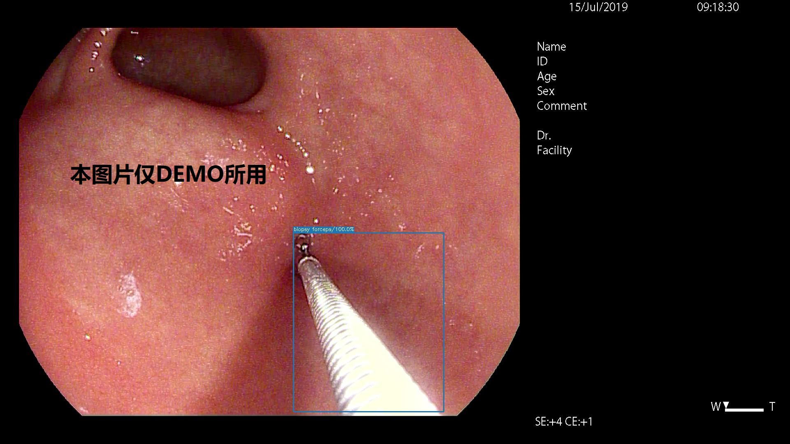

## **SSD**目标检测内镜活检钳

**XuJing**

### 1.:bookmark:数据标注及准备

数据来源公司业务数据(**因涉及数据安全及隐私数据，不能公开！！！**),我们使用[LabelImg](https://github.com/tzutalin/labelImg)标注我们的数据。标注好的数据我们存放在`data`文件夹下，其文件结构如下：

+ step1: 数据准备

```
data
├─tfrecord   # 生成的tfrecord
└─train      # 准备的VOC样式的数据集
    ├─Annotations   # 标注的训练集的标注文件
    └─JPEGImages    # 标注的图像文件
```

+ step2: 修改和数据相关的代码

```
#修改dataset/convert_common.py
VOC_LABELS = {
    'Background': (0, 'Background'),
    'biopsy forceps': (1, 'biopsy forceps')
}
data_splits_num = {
    'train': 22136,
    'val': 4952,
}
```

<details>
<summary><mark><font color=darkred>修改train.py</font></mark></summary>
<pre><code>
# hardware related configuration
tf.app.flags.DEFINE_integer(
    'num_readers', 8,
    'The number of parallel readers that read data from the dataset.')
tf.app.flags.DEFINE_integer(
    'num_preprocessing_threads', 24,
    'The number of threads used to create the batches.')
tf.app.flags.DEFINE_integer(
    'num_cpu_threads', 0,
    'The number of cpu cores used to train.')
tf.app.flags.DEFINE_float(
    'gpu_memory_fraction', 0.9, 'GPU memory fraction to use.')
# scaffold related configuration
tf.app.flags.DEFINE_string(
    'data_dir', './data/tfrecord',
    'The directory where the dataset input data is stored.')
tf.app.flags.DEFINE_integer(  # 类别个数包含背景
    'num_classes', 2, 'Number of classes to use in the dataset.')
tf.app.flags.DEFINE_string(
    'model_dir', './logs/',
    'The directory where the model will be stored.')
tf.app.flags.DEFINE_integer(
    'log_every_n_steps', 10,
    'The frequency with which logs are printed.')
tf.app.flags.DEFINE_integer(
    'save_summary_steps', 500,
    'The frequency with which summaries are saved, in seconds.')
tf.app.flags.DEFINE_integer(
    'save_checkpoints_secs', 7200,
    'The frequency with which the model is saved, in seconds.')
# model related configuration
tf.app.flags.DEFINE_integer(
    'train_image_size', 300,
    'The size of the input image for the model to use.')
tf.app.flags.DEFINE_integer(
    'train_epochs', None,
    'The number of epochs to use for training.')
tf.app.flags.DEFINE_integer(
    'max_number_of_steps', 120000,
    'The max number of steps to use for training.')
tf.app.flags.DEFINE_integer(
    'batch_size', 32,
    'Batch size for training and evaluation.')
tf.app.flags.DEFINE_string(
    'data_format', 'channels_first', # 'channels_first' or 'channels_last'
    'A flag to override the data format used in the model. channels_first '
    'provides a performance boost on GPU but is not always compatible '
    'with CPU. If left unspecified, the data format will be chosen '
    'automatically based on whether TensorFlow was built for CPU or GPU.')
tf.app.flags.DEFINE_float(
    'negative_ratio', 3., 'Negative ratio in the loss function.')
tf.app.flags.DEFINE_float(
    'match_threshold', 0.5, 'Matching threshold in the loss function.')
tf.app.flags.DEFINE_float(
    'neg_threshold', 0.5, 'Matching threshold for the negtive examples in the loss function.')
# optimizer related configuration
tf.app.flags.DEFINE_integer(
    'tf_random_seed', 20180503, 'Random seed for TensorFlow initializers.')
tf.app.flags.DEFINE_float(
    'weight_decay', 5e-4, 'The weight decay on the model weights.')
tf.app.flags.DEFINE_float(
    'momentum', 0.9,
    'The momentum for the MomentumOptimizer and RMSPropOptimizer.')
tf.app.flags.DEFINE_float('learning_rate', 1e-3, 'Initial learning rate.')
tf.app.flags.DEFINE_float(
    'end_learning_rate', 0.000001,
    'The minimal end learning rate used by a polynomial decay learning rate.')
# for learning rate piecewise_constant decay
tf.app.flags.DEFINE_string(
    'decay_boundaries', '2000, 80000, 100000',
    'Learning rate decay boundaries by global_step (comma-separated list).')
tf.app.flags.DEFINE_string(
    'lr_decay_factors', '0.1, 1, 0.1, 0.01',
    'The values of learning_rate decay factor for each segment between boundaries (comma-separated list).')
# checkpoint related configuration
tf.app.flags.DEFINE_string(
    'checkpoint_path', './model',
    'The path to a checkpoint from which to fine-tune.')
tf.app.flags.DEFINE_string(
    'checkpoint_model_scope', 'vgg_16',
    'Model scope in the checkpoint. None if the same as the trained model.')
tf.app.flags.DEFINE_string(
    'model_scope', 'ssd300',
    'Model scope name used to replace the name_scope in checkpoint.')
tf.app.flags.DEFINE_string(
    'checkpoint_exclude_scopes', 'ssd300/multibox_head, ssd300/additional_layers, ssd300/conv4_3_scale',
    'Comma-separated list of scopes of variables to exclude when restoring from a checkpoint.')
tf.app.flags.DEFINE_boolean(
    'ignore_missing_vars', True,
    'When restoring a checkpoint would ignore missing variables.')
tf.app.flags.DEFINE_boolean(
    'multi_gpu', True,
    'Whether there is GPU to use for training.')
</code></pre>
</details>

+ setp3: 生成tfrecord

```
python3 dataset/convert_tfrecords.py --dataset_directory=data
    --output_directory=./data/tfrecord
```

如果想训练自己的数据集可以将标注的数据存放在上述文件结构中，这样SSD的训练模型的数据集即准备完成。

### 2.:hammer:模型准备

我们使用[SSD: Single Shot MultiBox Detector](https://arxiv.org/abs/1512.02325) ,使用Tensorflow 1.0深度学习框架。如果你想使用原paper的代码，请参考[Official Code](https://github.com/weiliu89/caffe/tree/ssd). 该框架提供了：

+ VGG-16的预训练模型(SSD300-VGG16)

+ 使用Tensorflow的高级API [tf.estimator](https://www.tensorflow.org/api_docs/python/tf/estimator/Estimator)，并且我们推荐你使用该高级API.

+ 该框架全部使用Tensorflow实现.

+ 使用和官方相同的数据增强策略.

+ 使用[tf.layers](https://www.tensorflow.org/api_docs/python/tf/layers)，类似于Pytorch一样的易读.

+ 支持多GPU并行.

+ 使用Bounding Box的绝对坐标而不是标准化后的坐标[here](https://github.com/HiKapok/SSD.TensorFlow/tree/AbsoluteCoord).


> :fire: 下载预训练的模型[VGG-16](https://github.com/DataXujing/SSD-Tensorflow/releases/tag/v1.0)

把下载的预训练的VGG16拷贝到`./model/pretrain`下，这样我们就准备好训练自己数据的全部过程。

### 3.:chart_with_upwards_trend:模型训练

```
python3 train_ssd.py
```

### 4.:whale:模型测试

+ 图像测试

```
python3 test_img.py
```

+ 视频测试

```
python3 test_video.py
```

### 5.:globe_with_meridians:DEMO



### 6.:fire:目前存在的一些问题

+ 目前并不支持SSD-512
+ 目前并不支持其他的backbone
+ 训练过程中Nan Loss： 增加warm-up
    ```
    tf.app.flags.DEFINE_string(
        'decay_boundaries', '2000, 80000, 100000',
        'Learning rate decay boundaries by global_step (comma-separated list).')
    tf.app.flags.DEFINE_string(
        'lr_decay_factors', '0.1, 1, 0.1, 0.01',
        'The values of learning_rate decay factor for each segment between boundaries (comma-separated list).')
    ```

### 6.:tada:致谢

|Name   | Url|
|:-----|:------|
|:white_check_mark:Changan Wang|https://github.com/HiKapok/SSD.TensorFlow|
|:white_check_mark:Medcare|http://www.medicon.com.cn/|

